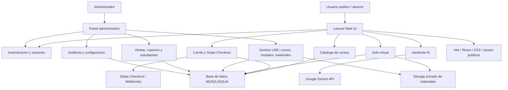

# Diagrama de arquitectura - JM y JS Alimentos LMS

Fecha: 2026-06-10

## Componentes principales

- Laravel 12 como backend MVC y capa de rutas web/API.
- MySQL en despliegue local XAMPP; SQLite para pruebas automatizadas.
- React/Vite para el widget de asistente IA.
- Storage privado para materiales descargables del aula.
- Google Gemini consumido solo desde backend para no exponer la clave al navegador.
- Stripe Checkout procesa los pagos fuera de la plataforma y confirma ventas mediante retorno seguro y webhooks firmados.
